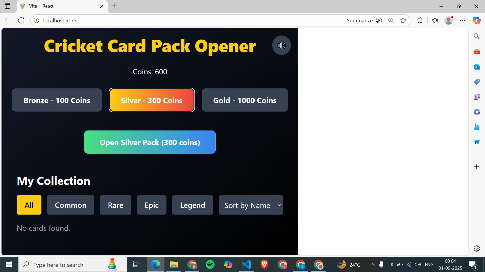
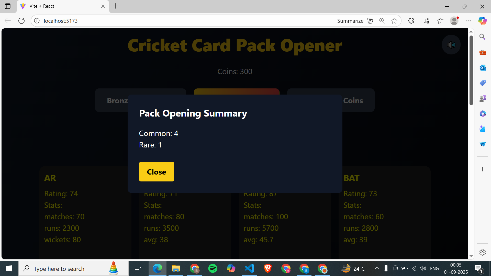
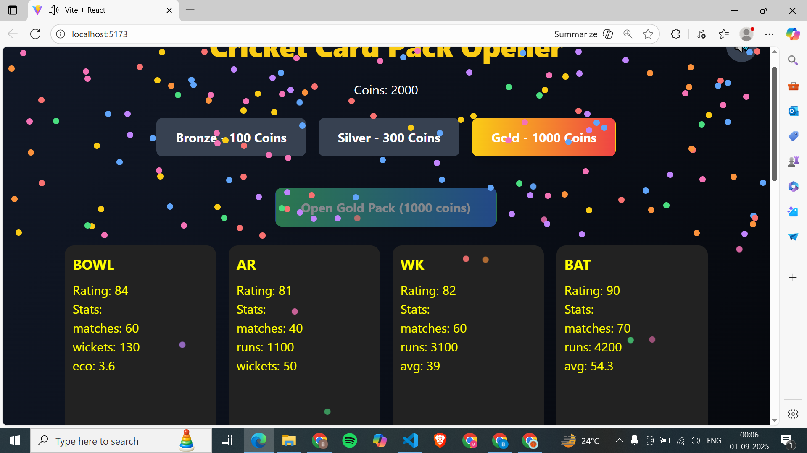
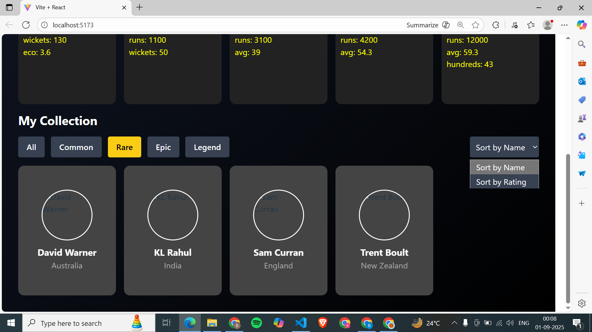

🏏 Cricket Pack Opener

A React-based cricket card pack–opening simulator inspired by FIFA Ultimate Team pack opening hype.
Includes cinematic animations, RNG-based odds, and a personal card collection.

🎯 Goal

Simulate the excitement of opening cricket player card packs with animations, reveal pacing,sound effects and collection management — all frontend only (React + mock JSON + RNG).

⚡ Features

✅ Packs – Bronze, Silver, Gold (with different odds & prices). Each contains ~5 random player cards.
✅ Opening Flow – Pack shakes, glows, flip-reveal, staggered reveals or “reveal all.” Rare pulls trigger slow-mo, glow, sparks, confetti.
✅ Cards – 4 rarities (Common, Rare, Epic, Legend) with unique card frames, cricket stats, and player photos.
✅ Inventory – Saved in localStorage with duplicate handling (auto-convert or upgrade).
✅ UI/UX – Responsive design, smooth 60fps animations, sound effects (open/flip/rare hit) with mute/unmute toggle button.
✅ Collection View – "My Collection" with filters (rarity, team, role).
✅ Summary Modal – After pack opening, shows pulled cards.
✅ Odds Tooltip – Shows drop rates before opening.

🛠️ Tech Stack

. React (Vite or Next.js)

. TailwindCSS (UI styling)

. Framer Motion / GSAP (animations)

. State Management: Context API / Redux / Zustand

. localStorage (inventory persistence)

🎲 RNG Logic

Each pack pull is powered by a random number generator (RNG) matching configured odds.

Example Odds (per card draw):

Bronze Pack → Common 70%, Rare 25%, Epic 4.5%, Legend 3%

Silver Pack → Common 40%, Rare 45%, Epic 13%, Legend 8%

Gold Pack → Common 20%, Rare 50%, Epic 25%, Legend 12%

👉 Each pack gives ~5 cards, rarity decided by rollRarity().
👉 Player data pulled from mock JSON (e.g. players.json) containing:

📂 Project Structure
/src
  /components   → UI & animations
  /data         → mock JSON (players, packs, odds)
  /hooks        → state & RNG helpers
  /pages        → main screens (Home, Collection, Pack Opening)
  /assets       → images, sounds

🚀 Setup & Run
1. Clone Repo
git clone https://github.com/your-username/cricket-pack-opener.git
cd cricket-pack-opener

2. Install Dependencies
npm install

3. Run Development Server
npm run dev

4. Build for Production
npm run build
npm run preview

🎨 Assets & Credits

-> Player images: Use your own designs OR placeholder cricket avatars.

-> Card frames: Custom-designed (bronze, silver, gold, rare tiers).

->Sounds:

      % pack shuffling 

      % Pack open 

      % Card flip 

      % Confetti / Spark effects: Canvas Confetti

📸 Screenshots

 

 

🏆 Future Enhancements

* Leaderboard & trading system (mock economy).

* Daily login rewards & streak bonuses.

* Live events (e.g. World Cup–themed packs).

* Online multiplayer pack battles.